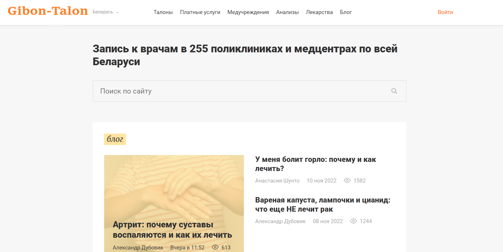
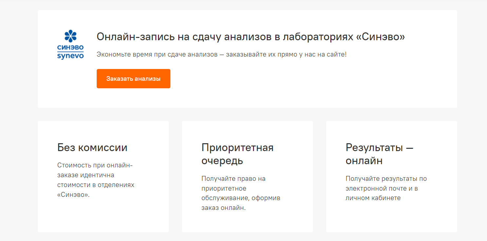
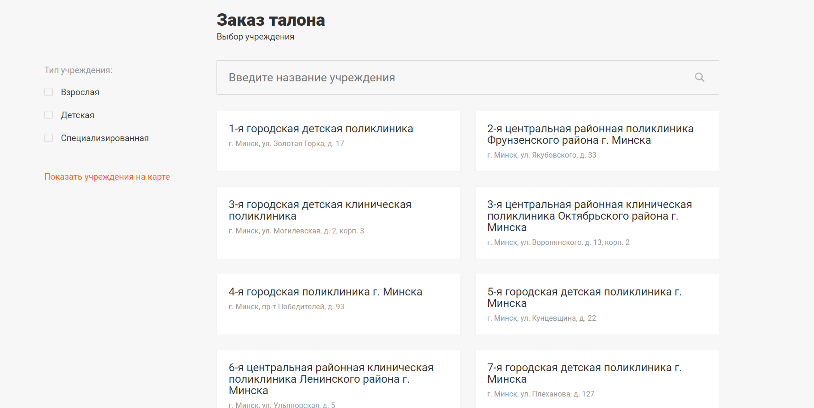
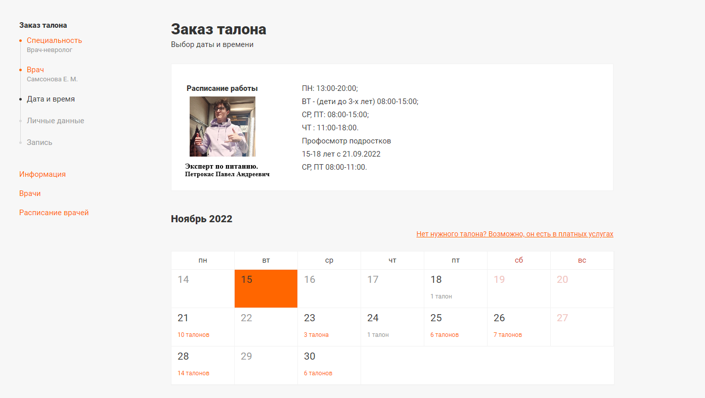

# Требования к проекту

---

## Содержание

[1 Введение](#1-введение)  
[1.1 Назначение](#11-назначение)  
[1.2 Бизнес-требования](#12-бизнес-требования)  
[1.2.1 Исходные данные](#121-исходные-данные)  
[1.2.2 Возможности бизнеса](#122-возможности-бизнеса)  
[1.2.3 Границы проекта](#123-границы-проекта)  
[1.3 Аналоги](#13-аналоги)  
[2 Требования пользователя](#2-требования-пользователя)  
[2.1 Интерфейс пользователя](#21-интерфейс-пользователя)  
[2.2 Характеристики пользователей](#22-характеристики-пользователей)  
[2.2.1 Классы пользователей](#221-классы-пользователей)  
[2.2.2 Аудитория приложения](#222-аудитория-приложения)  
[2.2.2.1 Целевая аудитория](#2221-целевая-аудитория)  
[2.2.2.2 Побочная аудитория](#2222-побочная-аудитория)  
[2.3 Предположения и зависимости](#23-предположения-и-зависимости)  
[3 Системные требования](#3-системные-требования)  
[3.1 Функциональные требования](#31-функциональные-требования)  
[3.1.1 Основные функции](#311-основные-функции)  
[3.1.1.1 Вход и выход пользователя в учетную запись](#3111-вход-и-выход-пользователя-в-учетную-запись)  
[3.1.1.2 Наличие уведомлений](#3112-наличие-уведомлений)  
[3.1.1.3 Удобный поиск](#3113-удобный-поиск)  
[3.1.1.4 Система заказов](#3114-система-заказов)  
[3.1.1.5 Наличие отзывов](#3115-наличие-отзывов)   
[3.1.2 Ограничения и исключения](#312-ограничения-и-исключения)  
[3.2 Нефункциональные требования](#32-нефункциональные-требования)  
[3.2.1 Атрибуты качества](#321-атрибуты-качества)  
[3.2.1.1 Требования к удобству использования](#3211-требования-к-удобству-использования)  
[3.2.1.2 Требования к безопасности](#3212-требования-к-безопасности)  
[3.2.2 Внешние интерфейсы](#322-внешние-интерфейсы)  

# 1 Введение

## 1.1 Назначение

В этом документе будут описаны функциональные и нефункциональные требования к
сайту "Gibon-Talon". Данный документ предназначен для
команды, которая будет реализовывать и заниматься отладкой работы сайта.

## 1.2 Бизнес-требования

### 1.2.1 Исходные данные
В наше время следить за своим здоровьем очень важно, но люди стали уделять этому меньше времени, т.к. процесс посещения поликлиники и покупки необходимых лекарств отнимает много времени. Сайт Gibon-talon позволяет легко и быстро заказать талон к нужному специалисту, а также записаться на процедуру или же найти ближайшую аптеку с нужными вам лекарствами.

### 1.2.2 Возможности бизнеса
Данный сайт предоставляет возможность быстро и удобно заказать талон из любой точки планеты, записаться на сдачу анализов,а также посмотреть ассортимент ближайших аптек.

### 1.2.3 Границы проекта

Сайт позволяет заказать талон к врачу в выбранном пользователем медучереждении , найти лекарства, а также сравнить цены на них в аптеках по всей стране, заказать различные платные услуги, предоставляет онлайн-запись на сдачу анализов.
полученные через него.

## 1.3 Аналоги
Talon.by - сайт, позволяющий заказать талон к врачу через интернет, вызвать врача на дом онлайн, посмотреть свободное время для записи на прием в поликлинику!
# 2 Требования пользователя

## 2.1 Интерфейс пользователя

Главная страница сайта.

Страница онлайн-заказа анализов.

Страница медучреждения.

Страница оформления талона.

## 2.2 Характеристики пользователей

### 2.2.1 Классы пользователей

| Класс пользователей             | Описание                                                                                                                        |
|:--------------------------------|:--------------------------------------------------------------------------------------------------------------------------------|
| Анонимные пользователи          | Пользователи, которые не хотят регистрироваться в приложении. Имеют доступ к частичному функционалу.                            |
| Зарегистрированные пользователи | Пользователи, которые вошли в приложение под своим именем. Имеют доступ к полному функционалу. Могут соверашать онлайн-запись на анализы и брать талон к врачу. |
| Аптеки-пользователи и медучередждения | Пользователи, обладающие возможностью выкладывать информацию о расписании кабинетов и о перечне лекарств в каталоге аптек.                                             |

### 2.2.2 Аудитория приложения

#### 2.2.2.1 Целевая аудитория

Люди любой возрастной категории, администрация медучереждений и аптек.
#### 2.2.2.2 Побочная аудитория
Отсутствует.

## 2.3 Предположения и зависимости

1. Сайт не работает без интернет соединения.
2. Сделать интерфейс максимально удобным для пользователей преклонного возраста.
3. Обязательное присутствие режима для слабовидящих пользователей.

# 3 Системные требования

## 3.1 Функциональные требования

### 3.1.1 Основные функции

#### 3.1.1.1 Вход и выход пользователя в учетную запись
Сайт позволяет пользователю использовать частичный функционал без регистрации, создать учетную запись для получения полного функционала, выйти из существующей учетной записи. Создание аккаунта медучереждения происходит с индивидуальным договором.
#### 3.1.1.2 Наличие уведомлений
Отсутствуют.
#### 3.1.1.3 Удобный поиск
Сайт использует большое количество категорий благодаря которым поиск происходит быстро и удобно.
#### 3.1.1.4 Система заказов
Сайт позволяет заказать талон к выбранному врачу, что автоматически отобразится в базе данных медучреждения.
#### 3.1.1.5 Наличие отзывов
Отсутствуют.
### 3.1.2 Ограничения и исключения

1. Приложение функционирует в полном наборе возможностей только при наличии
   подключения к Интернету;
## 3.2 Нефункциональные требования

### 3.2.1 Атрибуты качества

#### 3.2.1.1 Требования к удобству использования

1. Простой и удобный интерфейс с большим количеством категорий, которые не должны перегружать его

#### 3.2.1.2 Требования к безопасности

1. Приложение предоставляет возможность просмотра и редактирования
профиля только зарегистрированного пользователя.
2. Необходима верификация при создании аккаунта медучреждения.

### 3.2.2 Внешние интерфейсы

Элементы интерфейса распределены равномерно по всему экрану, акцентировано внимание на основной информации для совершения записи куда-либо.
